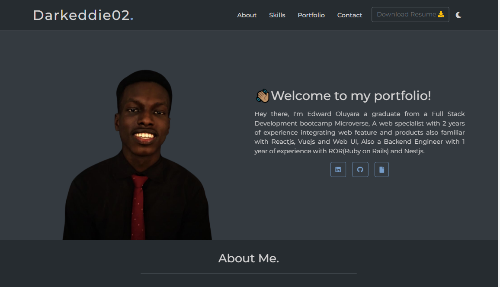

# my-portfolio-v2



## Netlify
- [View Live](https://meattech6.netlify.app/)

## Project setup
```
yarn install
```

### Compiles and hot-reloads for development
```
yarn serve
```

### Compiles and minifies for production
```
yarn build
```

### Lints and fixes files
```
yarn lint
```

### Customize configuration
See [Configuration Reference](https://cli.vuejs.org/config/).

## 👤 Author
- [darkeddie02](https://github.com/darkeddie02)
